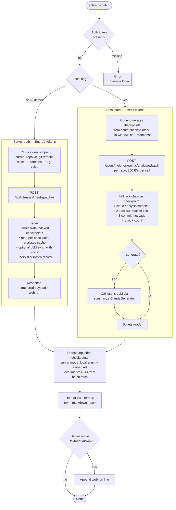

# `entire dispatch` — Design

**Date:** 2026-04-16
**Status:** Draft — awaiting review

## Summary

A new top-level CLI command, `entire dispatch`, that summarizes recent agent work into a dispatch-shaped bullet list.

**Default path — server-side generation.** The CLI calls a new entire.io endpoint, which enumerates checkpoints, consumes the existing per-checkpoint analyses, and (with `--generate`) synthesizes voice-styled prose using Entire's tokens. The same dispatch is also viewable on entire.io's web UI. CLI prints a URL to the web view alongside the rendered output.

**`--local` flag — local generation.** Bypasses the server entirely. CLI enumerates checkpoints from the local `entire/checkpoints/v1` branch, batch-fetches per-checkpoint analyses (read-only), assembles bullets via a fallback chain, and (with `--generate`) calls the user's own LLM. User pays the tokens.

Works on the current repo by default, scales out to explicit local paths via `--repos` (requires `--local`), and to entire GitHub orgs via `--org`.

Primary use case: users who publish a recurring dispatch/newsletter/update (like the [Entire Dispatch](https://entire.io/blog/entire-dispatch-0x0009)) get the bullet material generated from their actual shipped work without manually trawling `git log`, checkpoints, or PRs.

## Motivation

Existing surfaces don't cover this:

- `entire explain` — per-checkpoint deep-dive.
- `entire search` — cloud-backed, query-driven, per-result.
- `entire sessions` — live session management.
- `entire trail` — branch-level work tracking.

None of them produce a **multi-checkpoint rollup** shaped like a dispatch. The server-side checkpoint analysis pipeline (see analysis-endpoints PR) already generates per-checkpoint labels and 2–4 sentence summaries; `entire dispatch` consumes those to produce the rollup locally.

## Non-goals

- Replacing the server-side analysis pipeline — this command consumes it, not duplicates it.
- Publishing the dispatch anywhere (no Discord/Slack/email integration). Output is text to stdout; the user pastes it wherever.
- Editing or approving individual bullets. The user is expected to tweak the output manually if they want to ship it as-is.
- Supporting fully offline/no-login use. Login is hard-required.

## Command surface

```
entire dispatch [flags]
```

### Source flag

| Flag | Default | Description |
|---|---|---|
| `--local` | off | Generate the dispatch locally using the user's own LLM tokens. Without this flag, dispatch is generated server-side by entire.io using its own tokens, and the CLI only renders the structured response. |

### Scope flags

| Flag | Default | Description |
|---|---|---|
| `--since <duration-or-date>` | `7d` | Time window. Accepts Go duration (`7d`, `168h`, `2w`) and git-style strings (`"2 days ago"`, `"1 week"`, `2026-04-09`). Filters on checkpoint `created_at`. |
| `--branches <list>` | current branch | Comma-separated list of branch names to include. Pass `all` (or `*`) to include every branch. Without the flag, defaults to the current branch only. |
| `--repos <path1,path2,…>` | current repo | Comma-separated list of local repo paths. Each must be Entire-enabled; non-enabled paths are warned and skipped. Requires `--local` (the server can't inspect arbitrary local paths). Mutually exclusive with `--org`. |
| `--org <name>` | — | Enumerate every checkpoint you have access to whose repo belongs to this org. Works in both modes; in default mode, the server resolves the org; in `--local` mode, the CLI queries the cloud org-enumeration endpoint to discover checkpoint IDs. Mutually exclusive with `--repos`. |

### Output flags

| Flag | Default | Description |
|---|---|---|
| `--generate` | off | Synthesize bullets into a voice-styled dispatch via LLM (opener + themed sections + bullets + closer). In default mode, the server runs the LLM (Entire's tokens). In `--local` mode, the CLI runs the user's configured LLM (user's tokens). |
| `--voice <value>` | neutral | Voice/tone guidance for `--generate`. Resolution chain: (1) if value matches a built-in preset name (case-insensitive), use the preset; (2) else if value resolves to a readable file on disk, use its content; (3) else treat as a literal string. Built-in presets shipped with the CLI: `neutral` (default), `marvin` (sardonic AI companion, inspired by the Entire Dispatch). In default mode, passed to the server in the request body; in `--local` mode, used directly. |
| `--dry-run` | off | Show what checkpoints and labels would be fed to generation. Works with or without `--generate`. Makes no LLM calls and no cloud analysis fetches. In default mode, issues a dry-run request to the server (server returns scope preview without calling its LLM). |
| `--format <text\|markdown\|json>` | `text` | Output format. `text` = plain-text with `•` bullets and indented sections, suitable for terminals. `markdown` = pure markdown (`#` headers, `-` bullets, fenced where appropriate), paste-friendly for docs and blog posts. `json` = structured payload (checkpoints, analyses, labels, files) for pipelines. Rendering happens client-side in both modes — the server always returns the structured payload, and the CLI's renderer produces the requested format. |

### Behavior flags

| Flag | Default | Description |
|---|---|---|
| `--wait` | off | Block until pending/generating analyses complete (5-min cap). Default: skip + warn. Honored in both modes. |

### Auth

Hard require. Without a token, errors with `"run \`entire login\`"`. Same pattern as `entire search`.

### Examples

```
entire dispatch                                              # server-side, current repo
entire dispatch --since "last monday"
entire dispatch --branches main,release --since 14d
entire dispatch --branches all --since 1w
entire dispatch --org entireio --since 1w                    # server-side, whole org
entire dispatch --generate --voice "sardonic AI named Marvin"  # server runs LLM

entire dispatch --local                                      # local, user's tokens
entire dispatch --local --repos ~/Projects/cli,~/Projects/web  # --repos requires --local
entire dispatch --local --generate --voice ~/dotfiles/dispatch-voice.md

entire dispatch --format markdown > dispatch.md
entire dispatch --format json > dispatch.json
entire dispatch --dry-run --since 2w
```

## Data flow

Two paths: server-side (default) and local (`--local`). Both produce the same structured payload shape, which the CLI renders consistently.



### Server-side path (default)

1. CLI resolves the scope locally: determines the current repo's `owner/name` from `git remote` (or uses `--org`), collects `--since`, `--branches`, `--voice`, etc.
2. CLI issues a single call: `POST /api/v1/users/me/dispatches` with body `{repo: "<owner/name>"|null, org: "<name>"|null, since: <ISO>, branches: [...]|"all", generate: bool, voice: "<string>"|null, dry_run: bool}`.
3. Server enumerates checkpoints, consumes analyses (already cached per-checkpoint), optionally runs its LLM for `--generate`, persists the result (so entire.io can show it), and returns the structured payload plus a `web_url` pointing at the web view.
4. CLI renders to `--format`, prints the web URL at the end in `text`/`markdown` modes.

Server path requirements:
- New endpoint `POST /api/v1/users/me/dispatches` — see Server-side prerequisites below.
- Server stores dispatches for web display (persistence detail is owned by the server spec, not this one).

### Local path (`--local`)

For each checkpoint in the time window, resolve bullet text and section label via this chain:

1. **Cloud analysis** — `POST /api/v1/users/me/checkpoints/analyses/batch` with `{repoFullName, checkpointIds}`. Note: analysis-pipeline `status: failed` is distinct from an HTTP network failure — a pipeline failure on one checkpoint doesn't abort the command, whereas a network failure does (see Edge cases).
   - `status: complete` → use first `summary` block as bullet text, `labels` for section grouping.
   - `status: pending` or `generating` → skip with per-checkpoint warning; counted and reported at end of output. With `--wait`, poll until complete (5-min cap).
   - `status: failed` (pipeline error for this checkpoint) → fall through to step 2.
   - `404` (unknown to backend, i.e., unpushed) → fall through to step 2. Count as "unpushed" for the end-of-output nudge.
2. **Local summarize title** — if summarization is enabled (`settings.IsSummarizeEnabled()`) and a `Summary.Title` exists for the checkpoint in `entire/checkpoints/v1/<id>/…/metadata.json`, use it. No labels → checkpoint lands in a flat "Updates" section for its repo.
3. **Commit message subject** — if the checkpoint has an associated commit via the `Entire-Checkpoint` trailer, use the subject line. No labels → "Updates".
4. **None of the above** — omit the checkpoint from output. Count reported at end: `"N uncategorized checkpoints skipped."`

### Cloud calls (local mode only)

- **Batch analyses**: one call per repo, up to 200 IDs. Paginate over 200.
- **Org enumeration** (for `--org --local`): a new endpoint, `GET /api/v1/orgs/:org/checkpoints?since=<iso>&limit=…&cursor=…`, which returns `{checkpoints: [{id, repo_full_name, created_at}], cursor}`. Required only for `--org --local`. The server path uses its own internal enumeration.

### Unpushed-checkpoint detection

- **Local mode**: after batch fetch, any checkpoint that returns 404/unknown from the cloud is considered unpushed.
- **Server mode**: the server only knows about pushed checkpoints, so the CLI does a separate local count (enumerate local `entire/checkpoints/v1` commits in the window, subtract the set that the server's response references) to detect unpushed checkpoints.

If the count is > 0 and format is `text` or `markdown`, a single-line nudge is appended. In `--format json`, the count is surfaced as a `warnings.unpushed_count` field instead.

```
⚠ 7 checkpoints weren't pushed — run `git push origin entire/checkpoints/v1` for richer analysis next run.
```

## Output format

### `--format text` output (default, no `--generate`)

Plain, dispatch-shaped. Sections are `<repo-name>/` at the top level, then label-based subsections if cloud analyses supplied labels; otherwise a flat "Updates" block per repo.

```
entire dispatch  (7 days, current repo, current branch)

cli/
  CI & Tooling
    • CI tests no longer hang on TTY detection during local runs.
    • Nightly workflow now fails instead of silently skipping when tag exists.
    • Added Vercel preview deploy config for the frontend.

  Hooks & Messaging
    • Hook system messages reworded from "Powered by Entire" to "Entire CLI".

  Settings
    • Summary provider is persisted to local settings and respected by `entire configure`.

13 checkpoints · 4 branches · 23 files touched
⚠ 2 checkpoints weren't pushed — run `git push origin entire/checkpoints/v1` for richer analysis next run.
```

### `--generate` output

LLM pass stitches the same bullet data into a voice-styled dispatch. One call to the existing `summarize.ClaudeGenerator` with a dispatch-specific system prompt. Without `--voice`, neutral "product update" voice. With `--voice <file>`, the file's content is injected into the system prompt as voice guidance.

```
Beep, boop. Marvin here. Another week of entropy successfully postponed — this time across the CLI, mostly.

## CI & Tooling
- CI tests no longer hang on TTY detection during local runs.
- Nightly release workflow now fails instead of silently skipping.
- Added Vercel preview deploy config for the frontend.

## Hooks & Messaging
- Hook system messages reworded from "Powered by Entire" to "Entire CLI".

## Settings
- Summary provider is persisted to local settings and respected by `entire configure`.

— Until next week. The heat death of the universe remains roughly on schedule.
```

### `--format markdown` output

Same content as the default text output, but pure markdown — headings with `#`, bullets with `-`, inline code with backticks, no box-drawing characters. Designed to be pasted directly into docs, blog posts, or markdown-rendered Slack/Discord.

```
# entire dispatch

_7 days, current repo, current branch_

## cli

### CI & Tooling
- CI tests no longer hang on TTY detection during local runs.
- Nightly workflow now fails instead of silently skipping when tag exists.
- Added Vercel preview deploy config for the frontend.

### Hooks & Messaging
- Hook system messages reworded from "Powered by Entire" to "Entire CLI".

### Settings
- Summary provider is persisted to local settings and respected by `entire configure`.

---

_13 checkpoints · 4 branches · 23 files touched_
_⚠ 2 checkpoints weren't pushed — run `git push origin entire/checkpoints/v1` for richer analysis next run._
```

### `--format json` output

Structured payload with all source data, suitable for piping and scripting:

```json
{
  "generated_at": "2026-04-16T14:32:00Z",
  "window": {"since": "2026-04-09T00:00:00Z", "until": "2026-04-16T14:32:00Z"},
  "repos": [
    {
      "full_name": "entireio/cli",
      "path": "/Users/.../cli",
      "sections": [
        {
          "label": "CI & Tooling",
          "bullets": [
            {
              "checkpoint_id": "a3b2c4d5e6f7",
              "text": "CI tests no longer hang on TTY detection during local runs.",
              "source": "cloud_analysis",
              "branch": "main",
              "commit_sha": "700aace0f",
              "files_touched": ["cmd/entire/cli/summarize/summarize.go"],
              "created_at": "2026-04-14T18:23:00Z",
              "labels": ["CI & Tooling"]
            }
          ]
        }
      ],
      "skipped": {"pending": 0, "unpushed": 2, "uncategorized": 0}
    }
  ],
  "totals": {"checkpoints": 13, "branches": 4, "files_touched": 23}
}
```

### `--dry-run` output

Compact listing of what *would* be fetched/generated. No cloud calls, no LLM calls. Honors `--format`: text (default), markdown, or json (a stripped-down JSON payload with just enumerated checkpoint IDs + timestamps + branches).

```
entire dispatch --dry-run  (7 days, current repo, current branch)

Would fetch analyses for 13 checkpoints across 1 repo:

cli/
  a3b2c4d5e6f7  main         2026-04-14  Fix hanging CI tests locally
  b4c5d6e7f8a9  soph/fix     2026-04-14  fix hanging summary tty in local tests
  …

Would NOT call the LLM (no --generate).
```

## Architecture

### New package: `cmd/entire/cli/dispatch/`

```
dispatch.go       # top-level orchestration — dispatches to server or local path based on --local
server.go         # server-mode path: POST /api/v1/users/me/dispatches, parse response
local.go          # local-mode path: enumerate → resolve bullets → group
cloud.go          # shared API client: batch analyses, org enumeration, dispatches endpoint
render.go         # text / markdown / json renderers (format-agnostic, consumes shared types)
generate.go       # local --generate LLM pass via summarize.ClaudeGenerator
fallback.go       # the 3-step fallback chain (cloud → local summary → commit message)
types.go          # internal types: Dispatch, Repo, Section, Bullet — shared between modes
dispatch_test.go
server_test.go
local_test.go
cloud_test.go
render_test.go
generate_test.go
fallback_test.go
```

### Wired into cobra

- New file: `cmd/entire/cli/dispatch.go` (top-level, not inside `dispatch/`) — exports `newDispatchCmd()`, registered in `root.go` alongside `explain`, `search`, `sessions`.

### Reuses (no duplication)

| Existing | Used for |
|---|---|
| `cmd/entire/cli/checkpoint/` | Enumerate checkpoints locally via `GitStore` |
| `cmd/entire/cli/strategy` | `ListCheckpoints()` in the time window |
| `cmd/entire/cli/summarize` | `ClaudeGenerator` for `--generate` pass (new system prompt tuned for dispatch synthesis, not per-session summary) |
| `cmd/entire/cli/search` | Auth token lookup (`auth.LookupCurrentToken`), HTTP client pattern |
| `cmd/entire/cli/auth` | Same |
| `cmd/entire/cli/paths` | `WorktreeRoot`, `ToRelativePath` |
| `cmd/entire/cli/trailers` | Parse `Entire-Checkpoint` from commit messages |
| `cmd/entire/cli/settings` | `IsSummarizeEnabled()` for fallback step 2 |

### Intentionally NOT reused

- `cmd/entire/cli/explain.go` — different shape (per-checkpoint detail view).
- `cmd/entire/cli/sessions.go` — manages live sessions, not historical rollups.

### Server-side prerequisites

- `POST /api/v1/users/me/checkpoints/analyses/batch` — **exists** (see analysis-endpoints PR). Used in `--local` mode.
- `POST /api/v1/users/me/dispatches` — **new, required for default mode**. Takes scope params + generate/voice, returns the structured dispatch payload + `web_url`. Persists result so entire.io web can render.
- `GET /api/v1/orgs/:org/checkpoints?since=…&cursor=…` — **new, required for `--org --local`** only. Server-mode `--org` uses internal enumeration, so this endpoint isn't blocking for the default path.

Rough response shape for the new dispatches endpoint:

```json
{
  "id": "dsp_01H…",
  "web_url": "https://entire.io/dispatch/dsp_01H…",
  "window": {"since": "…", "until": "…"},
  "repos": [ /* same shape as --format json output below */ ],
  "totals": { "checkpoints": 13, "branches": 4, "files_touched": 23 },
  "warnings": { "unpushed_count": 2, "pending_count": 0, "uncategorized_count": 0 },
  "generated_text": "…"  /* only when `generate: true` in request; null otherwise */
}
```

**Workflow for adding new entire.io routes** — the `POST /dispatches` and `GET /orgs/:org/checkpoints` endpoints must be developed in a **new** git worktree whose branch is created off the `analysis-chunk-merge` branch (located at `/Users/alisha/Projects/wt/entire.io/analysis-chunk-merge`). Do **not** make changes on the `analysis-chunk-merge` worktree/branch itself — it is used only as the starting point. Also do not add backend routes from within the CLI repo worktree. Coordination: the CLI spec can merge independently of the server endpoints if the CLI is released without the server flag behavior enabled (or gated behind a feature flag until the server ships).

## Edge cases & error handling

| Case | Behavior |
|---|---|
| No checkpoints in window | Print `"No checkpoints in the last Nd."` · exit 0 |
| `--repos` without `--local` | Error: `"--repos requires --local"` |
| `--repos` path isn't a git repo (local mode) | Per-path error with path name, continue with remaining paths |
| `--repos` path is a git repo but not Entire-enabled | Warn + skip, continue |
| `--org` with no indexed checkpoints | Empty output with "try widening `--since`" hint · exit 0 |
| Network error during cloud fetch (either mode) | Abort with clear error. In default mode suggest `--local` as a workaround. |
| Server returns 5xx (default mode) | Retry once with backoff, then abort with `"server error — try --local"` |
| Server returns 404 (default mode — endpoint not deployed) | Clear error: `"dispatch server not available — use --local"` |
| `--wait` timeout (5 min) | Progress ticks while waiting; error out if still incomplete |
| `--generate` with zero eligible checkpoints | Skip LLM call, print same "no checkpoints" message |
| Auth token missing | Error: `"dispatch requires login — run \`entire login\`"` |
| Auth token expired/revoked | Error: `"login expired — run \`entire login\`"` |
| `--repos` and `--org` both passed | Error: `"--repos and --org are mutually exclusive"` |
| `--format json` and `--generate` both passed | Allowed — JSON payload includes a `generated_text` field with the LLM output |
| `--format json` and `--dry-run` both passed | Allowed — JSON version of dry-run payload (no cloud/LLM calls) |
| `--voice` without `--generate` | Error: `"--voice requires --generate"` |
| `--voice <value>` as a file path that looks like a file but can't be read | Error before any cloud calls. If the value has no path separators and doesn't resolve to a file, it's treated as a literal string (no error). |
| `--branches <list>` where a listed branch doesn't exist | Warn per missing branch, continue with remaining branches |
| `--format <value>` not in `text\|markdown\|json` | Error with list of valid values |

## Testing

### Unit (`cmd/entire/cli/dispatch/*_test.go`)

- **Mode selection** (`dispatch_test.go`) — `--local` routes to local path, absence routes to server path. Flag combinations (`--repos` without `--local` → error, `--org` allowed in both).
- **Fallback chain (local mode)** (`fallback_test.go`) — every branch: cloud complete → bullet, cloud pending → skip + count, cloud 404 → unpushed + fall through, cloud failed → fall through, local summary present → bullet, local summary absent + commit → bullet, none of above → omit + count.
- **Server client** (`server_test.go`) — happy path response parsing, 404/5xx mapping to user-facing errors, auth header, request body shape.
- **Section grouping** (`render_test.go`) — checkpoints with labels group by label; checkpoints without labels go into flat "Updates"; mixed case (some with labels, some without) — labeled group normally, unlabeled land in "Updates".
- **`--since` parsing** — Go durations, git-style relative, ISO dates, invalid inputs.
- **`--branches` parsing** — single branch, multiple branches, `all`/`*` wildcard, missing branch warnings.
- **`--voice` resolution** — file path that exists, file path that doesn't exist (error), literal string (no path separators), literal string that happens to match a file in cwd (still resolved as file).
- **Render golden files** — `--format text`, `--format markdown`, `--format json`, `--dry-run` (each format), `--generate` (with mocked LLM), web-url trailer in server mode.

### Cloud client (`cloud_test.go`)

- `httptest` server mock. Happy-path batch fetch, 200-ID pagination, 401 → auth error, 5xx → error (no retry), org enumeration with cursor.

### Integration (`cmd/entire/cli/integration_test/dispatch_*.go`)

- Build a test repo with several checkpoints using `testutil`, mock the cloud client, run `entire dispatch`, assert output shape and exit code.
- Cover default (server) mode with mocked server, `--local` mode with mocked analysis endpoint, `--branches`, `--repos` (local only), `--format text|markdown|json`, `--dry-run`.

### Vogon canary (`e2e/tests/dispatch_*.go`)

- Create N checkpoints via the Vogon fake agent over scripted prompts, run `entire dispatch`, assert bullets appear. Runs in `test:ci` — catches prompt parsing and renderer regressions without API cost.

### Real-agent E2E (optional, manual)

- `mise run test:e2e --agent claude-code -run TestDispatch` — runs `entire dispatch --generate` over a recorded fixture, asserts dispatch shape. Gated to avoid token cost in CI.

## Open questions / future work

1. **`--org` endpoint shape** — needs to be designed alongside the API team. Specifically: does it return checkpoint IDs only, or also enough metadata (repo, commit SHA) to skip the per-repo batch fetch? If the former, we do one enumeration call + one batch per repo. If the latter, one call does everything.
2. **Rate limits for large orgs** — an org with 500 checkpoints/week will do 3 batch calls (200 max each). Fine. An org with 10,000 checkpoints/week (large teams) starts hitting rate limits. Probably not an immediate concern; revisit if users report.
3. **Voice preset library** — v1 ships `neutral` and `marvin`. Future candidates: `plain`, `changelog`, `standup`, `release-notes`. Presets are plain markdown files in `cmd/entire/cli/dispatch/voices/`, embedded at build time; adding one is a code-free-ish drop-in. User-defined saved voices (e.g., `~/.config/entire/voices/`) deferred to post-v1.
4. **"Since last dispatch" mode** — currently user has to remember `--since` value. A `--since last-dispatch` mode that reads a timestamp from `.entire/state/last-dispatch` could be nice. Deferred to post-v1.
5. **Additional output formats** — current spec covers `text` (default) and `markdown`. Future candidates: `html` (email-ready), `rss` (for feed-driven newsletters), `slack` (Slack-flavored markdown). Deferred to post-v1.

## Interactive wizard

`entire dispatch` with no flags on a TTY auto-enters a `huh`-based wizard. Matches the codebase convention (`entire sessions stop`, `entire search`). With any flag passed, or stdin piped, the wizard is skipped and the command runs non-interactively.

### Trigger rules

- **Wizard ON** — stdin is a TTY AND no flags have been explicitly set.
- **Wizard OFF** — any flag passed (including flags with default-equal values), stdin is piped, or `ACCESSIBLE=1` with no flags (accessible mode uses `NewAccessibleForm()` internally, so wizard still shows but in accessible form).

### Step sequence

1. **Source mode** — Server (default, Entire's tokens) / Local (user's tokens). Maps to `--local`.
2. **Scope** — Current repo / Specific repos (disabled in server mode) / Whole org (prompts for org name) / Custom (jump to freeform flag review).
3. **Time window** — Last 24h / Last 7d (default) / Last 30d / Custom (text input accepting git-style or ISO).
4. **Branches** — Current branch / All branches / Select specific (multi-select from local refs).
5. **Generate prose?** — Bullets only / Generate full dispatch with voice (default in wizard). Maps to `--generate`. If "bullets only", skip step 6.
6. **Voice** (only shown if step 5 = generate) — Neutral product update (default) / Marvin (sardonic AI, Entire Dispatch style) / Custom (text input) / Load from markdown file (file picker).
7. **Format** — Text (default) / Markdown / JSON.
8. **Confirm & run** — Shows the equivalent CLI command, then asks: Run it now (default) / Copy command to clipboard and exit / Edit flags (jumps back to step 1) / Cancel.

Every step has a default that works on Enter; power users can tab through in a few seconds.

### Built-in voice presets

Shipped with the CLI binary via `go:embed`:

```
cmd/entire/cli/dispatch/voices/
  neutral.md       # neutral product-update tone (default)
  marvin.md        # sardonic AI companion, inspired by the Entire Dispatch
```

`--voice` value resolution (unchanged from command surface, repeated here for completeness): preset name (case-insensitive) → file path → literal string.

Adding more presets later: drop a new `.md` into `voices/`, register in a small map. No API changes.

### Accessibility

- All `huh` forms wrapped with the existing `NewAccessibleForm()` helper so `ACCESSIBLE=1` works without extra code per step.
- Escape at any step cancels the wizard cleanly (exit 130, no partial state written).

### Always-print equivalent command

The confirm screen always shows the full CLI command that the wizard assembled. Rationale:

- Users learn the flag syntax organically.
- "Copy command" option lets users drop the command into aliases / CI / scripts without going through the wizard each time.
- Useful for debugging and support ("run `entire dispatch --since 7d --branches main…` and paste the output").

### Wizard-specific tests

- **Step golden files** (`wizard_test.go`) — each step's prompt rendered as a fixture (TUI snapshot).
- **Full flow integration** — scripted stdin drives the wizard through a happy path and asserts the equivalent CLI command output matches expectations.
- **Flag-skip behavior** — any flag passed short-circuits the wizard; verified for each flag.
- **Accessible mode** — `ACCESSIBLE=1` renders plain text prompts, tested with golden output.
- **Cancel paths** — escape at each step cleans up and exits 130.

## Implementation plan

To be produced via the `writing-plans` skill once this spec is approved.
